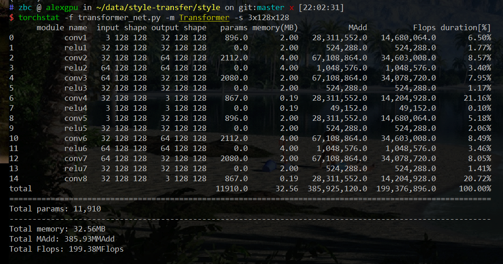
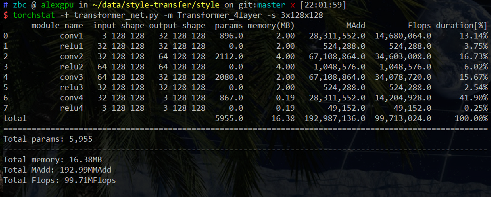
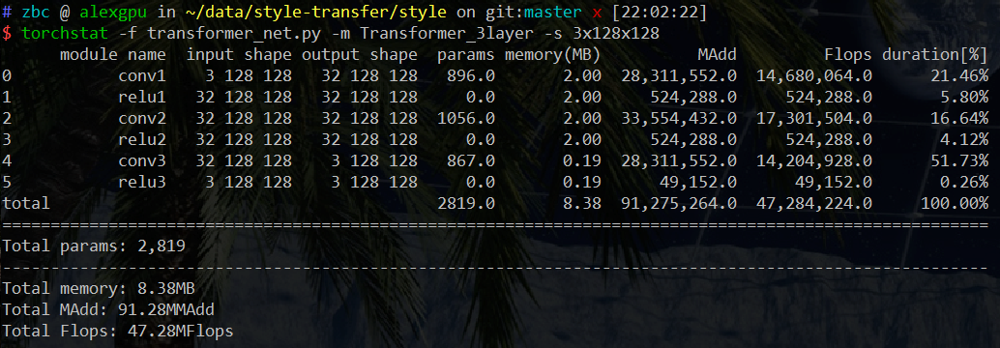
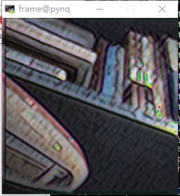
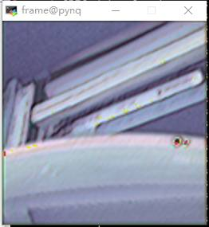
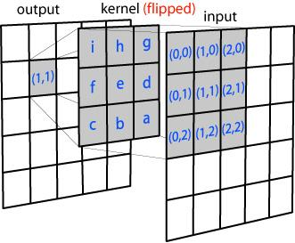
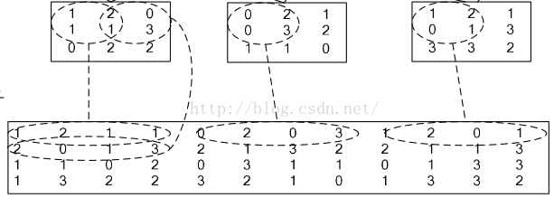
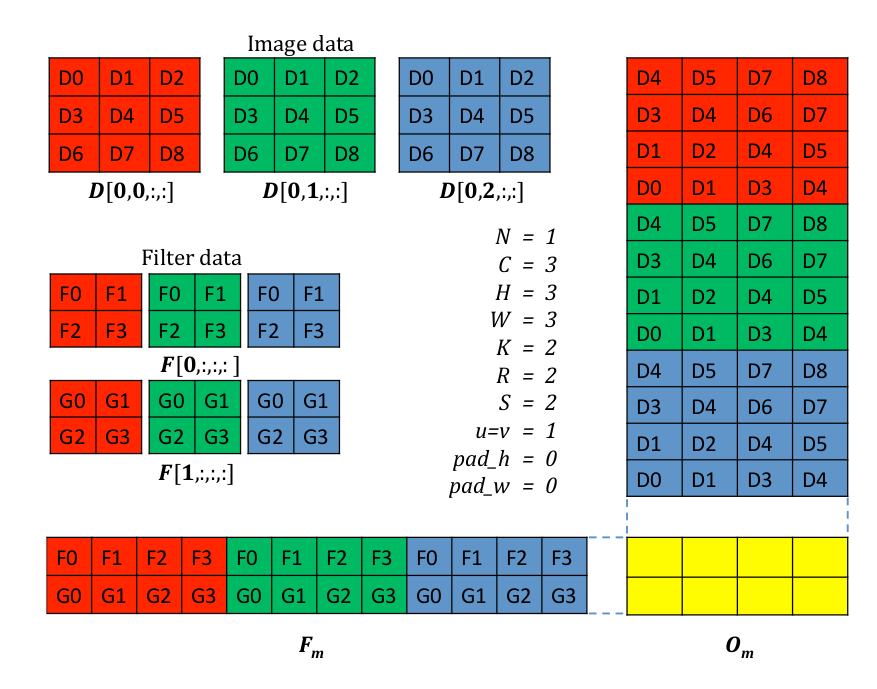

#          基于 PYNQ 的风格迁移说明文档 

- 1、概要
- 2、软件设计
- 3、硬件实现
- 4、算法优化
- 5、总结与反思

### 1、概要

近年来，随着深度学习的兴起，这项技术开始越来越多的运用在各个领域。
其中，风格迁移就是人们在艺术方向上的尝试：可以将一张图片 A 的风格迁移到
另外一张图片 B 上，得到一张新的图像 C，使得这张图片既有图片 B 的内容，又
有图像 A 的风格。风格迁移可以使用神经网络实现。但是使用 CPU 运行程序的时
候速度比较慢，使用 GPU 运行的时候耗费能量又太多，基于这样的情况，我们想
利用 FPGA 并行运算的能力，提高运行速度，同时降低能耗。同时利用 FPGA 告诉
处理视频的能力，实现实时的风格迁移。
我们小组现在已经基本实现 PYNQ 上实时运行风格迁移的代码，并且从多种
方向对代码进行了优化，尝试降低运行的时间。

### 2、软件设计

首先我们用斯坦福大学在Perceptual Losses for Real-Time Style Transfer 
and Super-Resolution中提出的方式训练一个可以用于实时推理风格迁移的神经网络，然后将这个神经网络的权重保存，移植到PYNQ板上进行推理。

#### 2-1 用于实时风格迁移的神经网络模型

神经网络可以解决的问题是优化问题，为了完成风格迁移的任务，我们首先需要将风格迁移的任务目标转化成一个可以被优化的函数，在Perceptual Losses for Real-Time Style Transfer 
and Super-Resolution中，作者提出了两个对神经网络的loss函数作为优化目标，分别为内容损失和风格损失。

内容损失（content loss）：

内容损失的优化目标为，让风格迁移后的图像的内容和原图差距尽可能的小，于是朴素的使用了MSE作为损失函数，即：
$$
L_{content}(I;\theta) = MSE(I, N(I;\theta))
$$

其中$I$为原图，$N(I;\theta)$为参数为$\theta$的神经网络的输入为图像$I$时的输出

风格损失（style loss）：

风格损失是一个很难客观评价的损失，在斯坦福大学的研究中，他们使用了一个预训练的神经网络VGG16作为一个特征提取器，计算VGG16网络提取出的特征之间的关系（feature correlations）来定义风格损失：
$$
G_{ij}(I)=\sum_{k}{F_{ik}(I)F_{jk}(I)}
$$

其中F(I)为VGG16网络提取出的图像$I$的特征矩阵，$i,j,k$为下标，$G$即为Gram Matrix
$$
L_{style}(I, I_{style};\theta) = \sum{(G_{ij}(N(I;\theta))-G_{ij}(I_{style}))}
$$

上式即为风格损失。

两式合并，得到最终的损失函数，
$$
L(I,I_{style};N, \theta)=L_{content}(I;\theta)+\lambda L_{style}(I,I_{style};\theta)
$$
其中$\lambda$为控制风格程度的参数。

通过反向传播算法求得$L$对神经网络参数$\theta$的梯度之后，使用梯度下降法就可以优化这个损失函数：
$$
\theta_{t+1}=\theta_{t}-\lambda_{lr}\frac{\part{L}}{\part{\theta_t}}
$$
其中$\lambda_{lr}$为学习率。最后学习得到的神经网络$N(\theta)$即为我们需要的可以进行风格迁移的神经网络。

在实际实现中，我们实现了三种不同大小的神经网络，分别统计了三种神经网络的参数量和实际的风格迁移效果。

神经网络结构如下图所示

这是第一个八层的神经网络，参数量为11910，图片经过八层卷积得到最终结果，其中在第四层卷积和第八层卷积之后加入了残差连接，以帮助神经网络学习得到更好的空间信息。

这是第二个四层的卷积网络，参数量为5955，并且在第四层卷积后加入了残差连接。

这是第三个三层的卷积网络，参数量为2819，并且在第三层加入了残差连接。

训练时选用下面这张图片作为风格图片。

训练时选用的图片是 cs231n 中提供的 tiny image net的test和val集，其中包含了 20000张 64*64 大小的图片。

训练的框架为PyTorch，在一个有GTX1080Ti显卡的服务器上完成了训练。

#### 2-2 将模型移植到PYNQ板

我们将使用PyTorch训练好的权重导出成numpy可以读取的格式`.npz`，用numpy实现模型所需要的卷积计算和ReLU函数，并且将卷积算法的关键部分**im2col**使用Cython编译成为`.so`，使得神经网络可以在PYNQ开发板上实现推理。

以下为我们的模型在开发板上使用单张图片进行推理的样例

    </img>
	</img> 
左图为原图，右图为8层网络风格迁移后结果

    </img>
	</img> 
左图为原图，右图为4层网络风格迁移后结果

可以看到8层网络的风格迁移效果较好，四层网络已经开始出现一些噪点，但总体效果还可以接受。同时可以发现，8层网络的风格更为突出，而4层网络的风格化较弱，这也是因为4层网络的表示能力较弱，只能学到较差的风格化。

同时我们分别用8层网络和4层网络实现了对视频流的处理，如下图所示：

    </img>
	</img> 
左图为8层网络风格迁移，右图为4层网络风格迁移

对于摄像头实时捕捉到的视频流进行风格迁移时，因为模型本身还需要时间来计算，所以视频流会卡顿，但是对录制好的视频进行风格化处理时，可以实现更好的效果。

### 3、硬件设计

我们组选择了 Logitech C270 500W 像素的 USB 摄像头，将其连接到开发板
的 USB 接口上。通过 notebook 使用 OpenCV 来调用摄像头。当 OpenCV检测到摄
像头并且令其开启之后，摄像头就会开始不断的捕捉图像。因为开发板本身没有提供图形界面，所以直接通过终端利用 opencv 中的imshow 函数就变得不可行。因此，我们使用了自动配置 X server 的 MobaXterm，通过 ssh 访问 192.168.2.99。从而实现摄像头捕捉的图像和转换风格之后的图像的输出。
至此，我们已经基本实现了利用摄像头连续不断地读取图像，输出到一个
框中。然后将每一帧的图片都进行风格迁移，输出到另一个框中。
但是因为基于 numpy 的神经网络运行速度较慢，所以输出时有卡顿，基于
这样的现象，我们决定对算法进行优化。

### 4、算法优化

4-1 卷积算法的介绍
卷积就是卷积核跟图像矩阵的运算。卷积核是一个小窗口，记录的是权重。
卷积核在输入图像上按步长滑动，每次操作卷积核对应区域的输入图像，将卷积
核中的权值和对应的输入图像的值相乘再相加，赋给卷积核中心所对应的输出特
征图的一个值。
下图很生动的解释了卷积算法的原理。

下图是一个卷积运算的动态演示过程。
但是因为朴素的卷积算法实现会从图像矩阵中不连续取值，导致运行的很慢
（单次处理图片的运行时间达到了 30s）。所以我们使用了 im2col 算法来优化
卷积运算。
Im2col 算法是将要处理的图像的部分矩阵和相应卷积核的数值按照行或者
列展开，从而将原来复杂的卷积运算转换为较快的矩阵乘法运算。我们假设卷积核的尺寸为 2x2，输入图像尺寸为 3x3。im2col 做的事情就是对于卷积核每一次要处理的小窗，将其展开到新矩阵的一行（列），新矩阵的列（行）数，就是对于一副输入图像，卷积运算的次数（卷积核滑动的次数），如下图所示：

以上只是对单层的数据进行处理。但是在风格迁移中，我们使用的是三通道
的图像。

三通道的im2col可以用下图来展示：

我们使用Cython将im2col算法编译到二进制形式来提高我们的算法的速度
